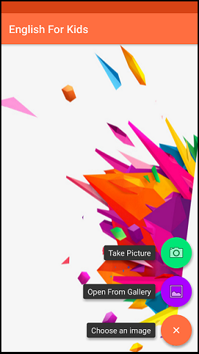
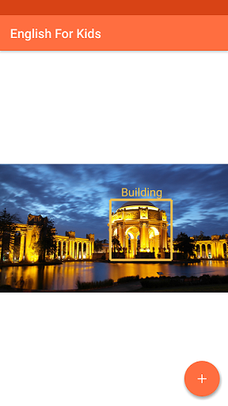

# English For Kids
A simple object detection app using Google's Vision API and Android's TTS feature.

## Features
The app annotates objects detected by Google's Object Localization API within an image (taken with the device's camera or from gallery). Objects are shown with a bounding box along with their names.

When an object's bound is tapped, its name is read aloud using Android's Text-to-speech capabilities.

## Screenshots




## API Key
The app requires a valid Google Cloud API key with the Vision API activated. See instructions on obtaining keys [here](https://cloud.google.com/docs/authentication/).

To bind a key to your own build, create a file called `secret.xml` in `app/src/main/res/values` with the following contents:
```
<?xml version="1.0" encoding="utf-8"?>
<resources>
    <string name="gcp_api_key">YOUR_API_KEY_HERE</string>
</resources>
```
